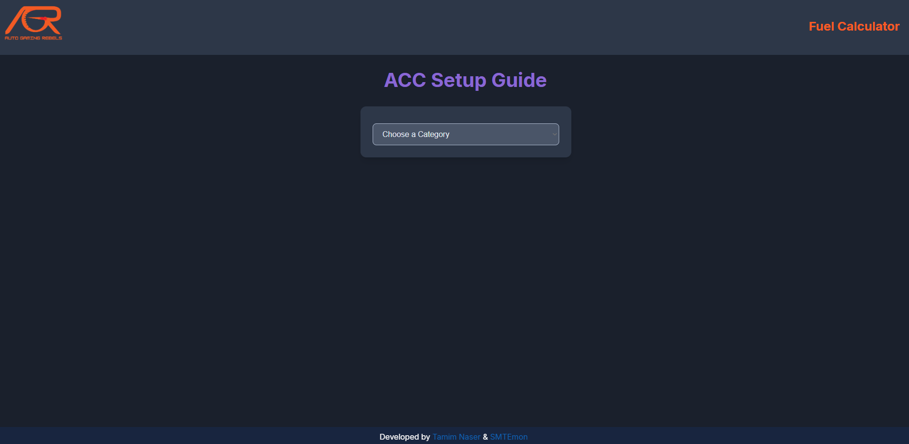

# ACC Setup Guide

An interactive web-based guide to help Assetto Corsa Competizione (ACC) players diagnose and resolve common car setup issues. Navigate through a series of selections to pinpoint your problem and receive categorized suggestions for setup adjustments.

**[➡️ View the Live Demo Here](https://istamimnaser.github.io/ACC-Setup-Guide/)**

Inspired by common setup flowcharts, this tool aims to provide a user-friendly and dynamic way to improve your ACC car setups.

## ✨ Features

*   **Interactive Diagnosis:** Step-by-step selection process to narrow down setup problems.
*   **Categorized Solutions:** Solutions are grouped by setup area (Tyres, Mechanical Grip, Aero, Electronics, Dampers) for clarity.
*   **Visual Cues:** Icons for solution categories and clear visual hierarchy.
*   **Flowchart Path:** Displays your selection path for easy reference.
*   **Responsive Design:** Usable on various screen sizes.
*   **Dynamic Content:** JavaScript populates options and solutions based on user input.
*   **Reset Functionality:** Easily start a new diagnosis.
*   **Quick Link:** Includes a link to an external ACC Fuel Calculator.

## 📸 Screenshots

*(It's highly recommended to add a screenshot or a GIF here showing the tool in action. For example:)*

*A GIF showing the selection process and solution display would be ideal.*

**Example Screenshot:**

## 🚀 How to Use

1.  **Open the Guide:** Navigate to the `index.html` file in your browser or visit the live demo link.
2.  **Choose a Category:** Select the primary area where you're experiencing an issue (e.g., "Corners", "Tyres", "Breaks").
3.  **Refine Your Issue:** Based on your first selection, further dropdowns will appear. Continue selecting options that best describe your problem.
4.  **View Solutions:** Once you've drilled down to a specific issue, a list of potential solutions will be displayed. Solutions are categorized for easier understanding (e.g., adjustments to Tyres, Mechanical Grip, Aerodynamics).
5.  **Apply & Test:** Try the suggested setup changes in ACC. Remember to change one thing at a time to understand its effect.
6.  **Reset:** If you want to diagnose a new issue, click the "Look for a new Issue" button.

## 🛠️ Technology Stack

*   **HTML5:** For the basic structure of the web page.
*   **CSS3:** For styling, layout, and animations, creating a modern and responsive user interface.
*   **JavaScript (ES6+):** For all the interactive logic, dynamic content generation, and handling user selections.

## 🧠 Core Logic (`index.js`)

The heart of the application lies in the `categories` object within `index.js`. This object defines:
*   The hierarchy of selectable options.
*   The specific issues under each category.
*   The corresponding solutions for each pinpointed issue.

Each key in the `categories` object can either lead to further `options` (another dropdown) or directly to `solutions`. Solutions are themselves objects categorized by setup areas (e.g., `tyres`, `mechanical_grip`, `aero`).

## 💡 Future Enhancements (Ideas)

*   More detailed explanations for each solution.
*   Ability to filter solutions by car type (if applicable).
*   User accounts to save common issues or preferred solutions.
*   Community-driven suggestions or notes on solutions.
*   Search functionality for issues or solutions.

## 🤝 Contributing

Contributions are welcome! If you have suggestions for improvements, new features, or more accurate setup advice, please feel free to:

1.  Fork the repository.
2.  Create a new branch (`git checkout -b feature/YourAmazingFeature`).
3.  Make your changes.
4.  Commit your changes (`git commit -m 'Add some YourAmazingFeature'`).
5.  Push to the branch (`git push origin feature/YourAmazingFeature`).
6.  Open a Pull Request.

Please ensure your code follows the existing style and that any new setup advice is well-vetted.

## 🙏 Acknowledgements

*   Developed by [Tamim Naser](https://github.com/istamimnaser) & [SMTEmon](https://github.com/SMTEmon).
*   ACC community for the wealth of setup knowledge.
