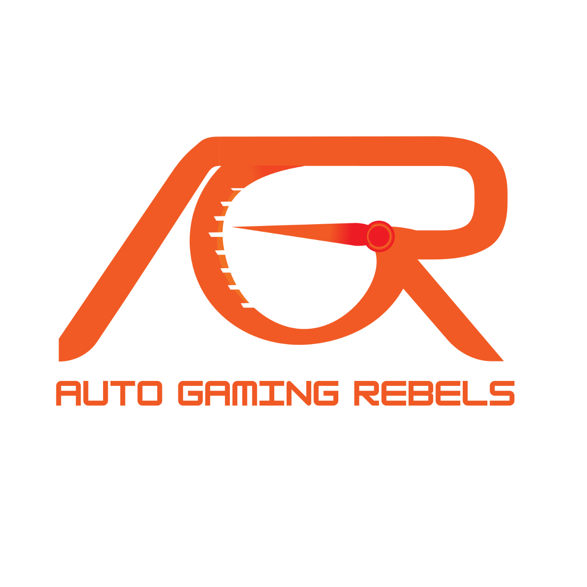

# AGR ACC Setup Guide

An interactive setup troubleshooting assistant for **Assetto Corsa Competizione (ACC)** drivers.

This project helps sim racers diagnose car handling problems and provides categorized setup recommendations for improving car balance, tire behavior, braking, aerodynamics, and stability.

Used by members of the **Bangladesh Sim Racing Community** to improve setups faster without needing advanced engineering knowledge.

---

## 🌐 Live Demo

➡️ https://istamimnaser.github.io/ACC-Setup-Guide/

---

# 🏁 Why This Project Exists

ACC setup tuning can be overwhelming for many drivers.

Most racers struggle with:
- Understanding setup terminology
- Fixing understeer or oversteer
- Tire overheating issues
- Brake instability
- Aerodynamic imbalance
- Kerb instability
- Wet or endurance race setup changes

This tool simplifies setup troubleshooting into an easy step-by-step flow.

---

# ✅ Problems It Solves

## 🛞 Setup Troubleshooting
Guides users through:
- Corner entry issues
- Mid-corner balance
- Corner exit traction
- Tire temperature problems
- Brake locking and instability
- Straight-line performance

---

## 📚 Beginner-Friendly Learning
Helps newer ACC drivers understand:
- Mechanical grip
- Aero balance
- Tire pressure effects
- Differential tuning
- Dampers and suspension

Without needing deep engineering knowledge.

---

## ⚡ Faster Setup Adjustments
Instead of searching through forums or YouTube videos, drivers can quickly:
- Identify the issue
- Follow the setup flowchart
- Apply categorized setup changes

---

## 🏎 League & Endurance Preparation
Useful for:
- League racing
- Endurance racing
- Daily races
- Coaching sessions
- Community practice events

---

# 🎨 Features

- Interactive setup diagnosis system
- Dynamic category selection
- Categorized setup solutions
- Motorsport-inspired UI redesign
- Mobile responsive design
- Visual setup flow tracking
- Quick navigation between issues
- Integrated Fuel Calculator access

---

# 🛠 Tech Stack

- HTML5
- CSS3
- JavaScript

---

# 👥 Community Usage

This tool is actively used by members of the **Bangladesh sim racing community** to:
- Learn ACC setup tuning
- Improve consistency
- Reduce setup confusion
- Prepare for competitive league racing

The project was created to make setup knowledge more accessible for South Asian sim racers and beginners entering competitive ACC racing.

---

# 🚀 Future Plans

- Car-specific setup recommendations
- Wet setup assistance
- AI-powered setup suggestions
- Telemetry integration
- Community voting system
- Multi-language support

---

# 👨‍💻 Developers

Developed by:
- Tamim Naser
- SMTEmon
- AGR (Auto Gaming Rebels)

---

# 🤝 Contributions

Contributions, setup improvements, and racing feedback are welcome.

Feel free to:
- Fork the repository
- Improve setup logic
- Suggest new troubleshooting paths
- Add support for more simulators

---

# 📄 License

This project is open-source and available under the MIT License.
